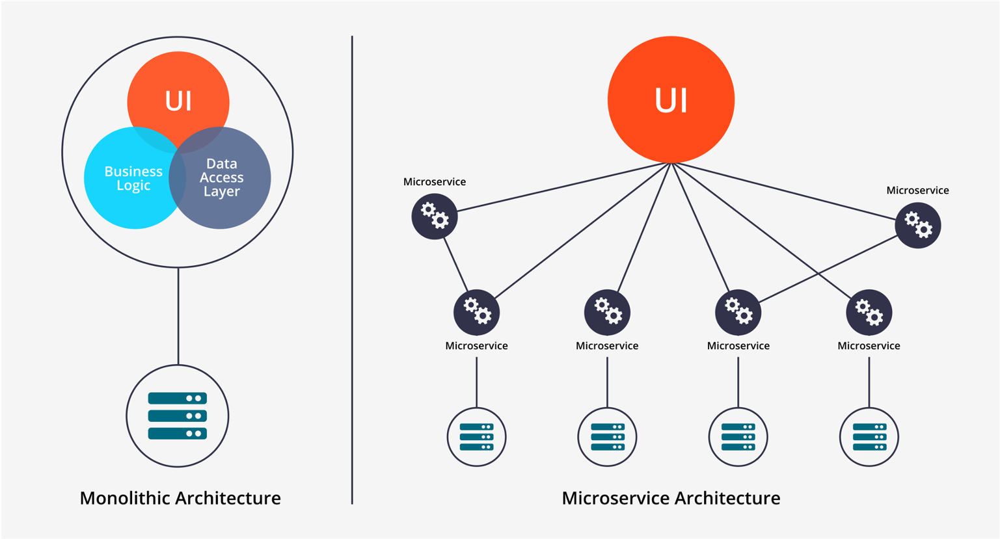
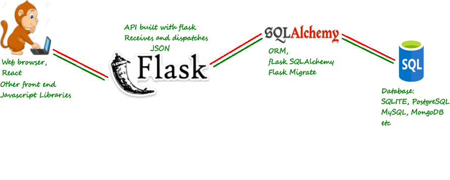
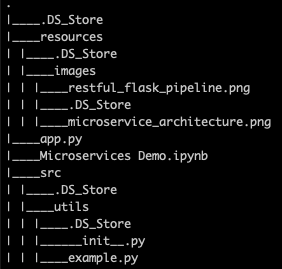

# Microservices Lecture and Demo
See [the notebook]() for all examples.
## Justin A. Gould (gould29@purdue.edu)
## January 2021

[The notebook]() will provide examples of:
- Lecture on Microservices and APIs:
  - What are Microservices and APIs?
  - How to Create Microservices (in Python)
  - Demonstrations:
    - Modularized vs. non-modularized code
    - Calling demo microservices from a Flask app
      - _You **MUST** run the Flask app (`python3 app.py`) for these example to work!_
    - Calling Internal Packages in a Demo Notebook

# What are Microservices and APIs?

IBM defines microservices (or microservices architecture) as: a cloud-native architectural approach in which a single application is composed of many loosely coupled and independently deployable smaller components, or services:
 - Deployed and given an endpoint to accept an input payload and provide a response
 - Microservices can communicate with one another via REST APIs
 - Allows for code reuse by turning **modularized code** into a **callable service**

 ## Microservice Architecture:

# How to Create Microservices (in Python)

Creating microservices in Python is simple! All you need is modularized code, structured as a function (an example will follow below). From there, you can wrap your function into a Flask app, assign an endpoint (think of it as a URL) that accepts a given `input` to provide a desired `output`, and you're done.

### Pipleline:
**Green:** `get_data(table)`
 - Build SQL Alchemy query to retrive data from DB and return to user on screen

**Red:** `add_row(table, row_list)`
 - Build SQL Alchemy query to add `row_list` as a row in `table` and commit changes to DB

### Code Hierarchy:

- `./app.py`: Flask application (run in your terminal via `python3 app.py`
- `./src/utils/example.py`: File containing all functions used in demo